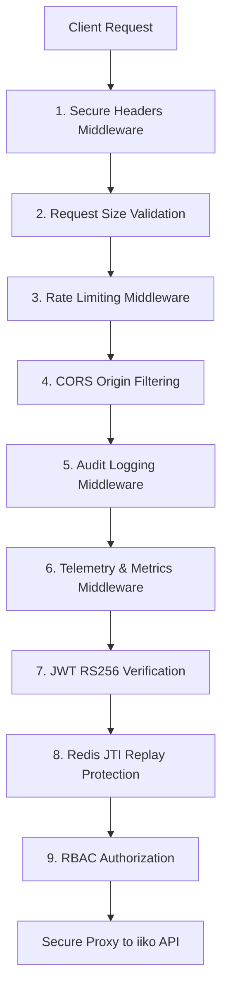

# ISAG — Technical Architecture & Request Flow Analysis

**iiko Secure API Gateway (ISAG)** is an asynchronous, high-performance reverse proxy designed as a security gateway. It represents a production-grade implementation of the **Defense-in-Depth** and **Zero-Trust** security models, specifically tailored for securing third-party integrations with the iiko ERP/API ecosystem.

---

## 1. Architectural Philosophy

ISAG operates under the following core design principles:
*   **Secure-by-Design**: Security checks are integrated into the core request path, ensuring no request bypasses validation.
*   **Fail-Closed**: In case of database lockups, Redis unreachability, key loading errors, or parsing exceptions, the gateway defaults to blocking the request (`HTTP 401` or `HTTP 500` with sanitized details).
*   **Zero-Trust Model**: Every request is authenticated and authorized, regardless of origin, using cryptographic signatures (RS256) and Role-Based Access Control (RBAC).
*   **Defense-in-Depth**: Multiple independent validation layers ensure that if one security constraint is bypassable, others (e.g. rate limits, payload validation) will catch and drop the attack.

---

## 2. Integrated Security Pipeline (9 Stages)

When a request enters the gateway, it traverses a structured stack of **FastAPI Middlewares** and **Security Dependencies** registered in a Last-In-First-Out (LIFO) middleware stack. This order ensures that cheap checks (like payload size) run before expensive ones (like database access or signature validation).

| Stage | Component | Category | Purpose | Implementation details |
| :--- | :--- | :--- | :--- | :--- |
| **1** | **TLS/Secure Headers** | Transport | Injects HSTS, CSP, X-Frame-Options, XSS protection headers. | [secure_headers.py](file:///d:/Desktop/Дипломка%20-%20iiko%20Secure%20API%20Gateway%20(ISAG)/backend/app/middleware/secure_headers.py) |
| **2** | **DoS Protection** | Resource | Rejects request bodies larger than 10MB immediately. | [size_validator.py](file:///d:/Desktop/Дипломка%20-%20iiko%20Secure%20API%20Gateway%20(ISAG)/backend/app/middleware/size_validator.py) |
| **3** | **Rate Limiting** | Abuse | Limits request rates per-IP and per-Client using Redis. | [rate_limiter.py](file:///d:/Desktop/Дипломка%20-%20iiko%20Secure%20API%20Gateway%20(ISAG)/backend/app/middleware/rate_limiter.py) |
| **4** | **CORS Gating** | Origin | Verifies client browser requests against a strict allowed origin list. | FastAPI `CORSMiddleware` in [main.py](file:///d:/Desktop/Дипломка%20-%20iiko%20Secure%20API%20Gateway%20(ISAG)/backend/app/main.py) |
| **5** | **Audit Logging** | Forensics | Generates correlation IDs and prepares DB logs for request trail. | [audit.py](file:///d:/Desktop/Дипломка%20-%20iiko%20Secure%20API%20Gateway%20(ISAG)/backend/app/security/audit.py) |
| **6** | **Telemetry** | Observation | Logs Prometheus metrics with path-normalization to prevent leaks. | [metrics.py](file:///d:/Desktop/Дипломка%20-%20iiko%20Secure%20API%20Gateway%20(ISAG)/backend/app/middleware/metrics.py) |
| **7** | **JWT RS256** | Identity | Validates token signatures using public keys and expiration claims. | [jwt_validator.py](file:///d:/Desktop/Дипломка%20-%20iiko%20Secure%20API%20Gateway%20(ISAG)/backend/app/security/jwt_validator.py) |
| **8** | **Replay Protection** | State | Stateful JTI checking in Redis with a 2-second grace period. | [jti_store.py](file:///d:/Desktop/Дипломка%20-%20iiko%20Secure%20API%20Gateway%20(ISAG)/backend/app/security/jti_store.py) |
| **9** | **RBAC Authorization** | AuthZ | Enforces roles and scopes permissions on targeted endpoints. | [rbac.py](file:///d:/Desktop/Дипломка%20-%20iiko%20Secure%20API%20Gateway%20(ISAG)/backend/app/security/rbac.py) |

---

## 3. Core Security & Architecture Mechanisms

### 🔑 Zero-Downtime Key Rotation (RS256)
ISAG implements public-key cryptography to verify client credentials. Tokens are signed by the gateway using a private key and validated using corresponding public keys:
- **Header Injection**: Clients specify the Key ID (`kid`) in their token's header.
- **On-Demand Key Store**: The `JWTValidator` checks the `kid` and matches it against `keys/public_keys.json` (loaded in memory on startup to avoid disk I/O). 
- **Rotation**: Administrators can add new public keys to the JSON store, issue tokens with the new `kid`, and phase out old keys without causing service downtime or restarts.

### 🛡️ Token Type Separation (Access vs. Refresh)
To prevent privilege escalation, ISAG enforces token type separation:
- **Access Tokens**: Short-lived (15 minutes), containing client roles/scopes, used to access `/api/*` proxies. If presented to the refresh endpoint, they are immediately rejected.
- **Refresh Tokens**: Long-lived (7 days), containing no roles/scopes, used exclusively at `/auth/refresh` to rotate token pairs. If presented to proxy routes, they are rejected.

### 🔄 Stateful Replay Protection (JTI Grace Window)
To prevent network sniffers from capturing and reusing tokens, refresh tokens must be single-use.
- **Atomic Registration**: When a refresh token is presented, its JWT ID (`jti`) is written to Redis using an atomic `SET NX EX` command, set to expire alongside the token.
- **Parallel Race Mitigation (Grace Window)**: High-latency connections or browser retries can spawn duplicate requests. To prevent dropping legitimate calls, ISAG supports a configurable `jti_replay_grace_period_seconds` (default: 2s). The first reuse within 2 seconds increments an atomic Redis counter `isag:jti:grace:{jti}`; if the counter exceeds 1 (indicating a third use) or the time delta exceeds 2s, the request is hard-blocked.

### ⚡ Anti-Timing Oracle Safeguard
To prevent attackers from enumerating valid client IDs by analyzing response times:
- Database authentication lookups use a constant-time hashing validation flow.
- If a client ID is not found in the SQL registry, a dummy password validation `dummy_verify()` is triggered. This introduces a cryptographically comparable verification delay, blinding side-channel attack attempts.

---

## 4. Observability, Telemetry & Monitoring

### Prometheus Metrics
To maintain high performance, metric labels must be strictly bound:
- **Cardinality Explosion Mitigation**: Dynamic variables in URLs (e.g. `/api/v1/orders/12345`) are normalized in metrics to `/api/{path}`.
- Normalization prevents Prometheus database bloat and ensures fast dashboard queries under high volume.

### Grafana Dashboards
The monitoring stack includes automated provisioning configuration to load predefined metrics dashboards. The dashboards track:
1.  **Security Events**: Blocked rate limits, invalid JWTs, expired signatures, and replay block distributions.
2.  **Performance Metrics**: Request latencies, upstream proxy delay, memory and CPU footprints.
3.  **Client Analytics**: RPS breakdown by partner ID.
