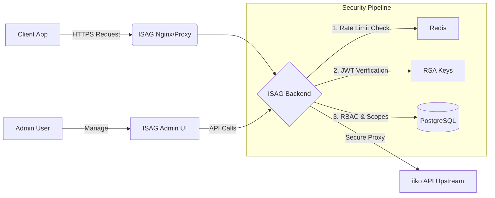

# ISAG — iiko Secure API Gateway

**ISAG (iiko Secure API Gateway)** is a high-performance, asynchronous reverse proxy designed to secure integrations with the iiko API. Operating on a **Zero-Trust** model, it enforces Defense-in-Depth security principles while providing a modern, high-fidelity administrative dashboard.

## 🌟 Core Features

- **Zero Trust Architecture**: Every request is cryptographically verified (JWT RS256) and strictly authorized via RBAC.
- **Glassmorphism UI**: A stunning, premium React/Vite dashboard featuring dynamic animations, fluid transitions, and responsive design.
- **Real-time Threat Feed**: The dashboard features a "Live Event Ticker" mapping recent security events (e.g., token revocation, rate limits) with immediate visual feedback.
- **Audit Logging**: Comprehensive, JSON-structured tracking of administrative actions (Client Creation, Secret Rotation, Status Toggling) with IP tracking.
- **Secret Rotation**: Secure, on-demand client credential lifecycle management directly from the UI without service interruption.

[](https://github.com/sanzhartech/iiko-Secure-API-Gateway--ISAG/actions/workflows/ci.yml)


## 🏗️ Architecture



## 🛡️ Security Features

- **Scopes & Granular Access**: Each client is provisioned with specific API scopes (e.g., `orders:read`), ensuring they can only access the endpoints they explicitly need.
- **Rate Limits**: Configurable per-client and global rate limits prevent abuse, resource exhaustion, and DoS attacks.
- **Replay Protection**: Strict JWT ID (JTI) tracking prevents captured tokens from being reused.

## 🚀 Quick Start (One-Click Deployment)

Ensure you have Docker and Docker Compose installed.

### 1. Clone & Configure
```bash
git clone https://github.com/sanzhartech/iiko-Secure-API-Gateway--ISAG-.git
cd iiko-Secure-API-Gateway--ISAG-
```

### 2. Generate RSA Keys
Before starting, generate the secure keys used for JWT signing:
```bash
python scripts/generate_keys.py
```

### 3. Launch the Stack
Deploy the Postgres database, Redis cache, FastAPI backend, and React/Nginx frontend:
```bash
docker-compose up -d --build
```

### 4. Access the Dashboard
Open your browser and navigate to:
**http://localhost**

Log in using the default credentials specified in your `docker-compose.yml`.

---

## 📑 Documentation

For a comprehensive understanding of the system, please refer to the following documentation sections:

*   **[Technical Architecture & Request Flow](ARCHITECTURE.md)** — Architectural design, pipeline breakdown, and key data structures.
*   **[Deployment & Operations Guide](DEPLOYMENT.md)** — Docker setup, manual startup, Nginx configurations, and setup procedures.
*   **[Security Controls & Specifications](SECURITY.md)** — Comprehensive cryptography, JWT validation, rate limiting, and replay protection details.
*   **[Environment Configuration Guide](ENV_CONFIG.md)** — Full specification of environment variables and settings.
*   **[Troubleshooting Manual](TROUBLESHOOTING.md)** — Diagnostics, recovery steps, and solutions for common operational issues.
*   **[Testing & Quality Verification Report](TESTING_REPORT.md)** — Test suite results, code coverage, stress testing, and attack simulations.
*   **[Mathematical & Cryptographic Justifications](technical_documentation.md)** — Proofs of RS256 security, rate-limiting, and auditing database schemas.


## 🛠️ Demo & Defense Presentation

To demonstrate the gateway's real-time defensive capabilities during a presentation, run the provided `demo_attack.py` script:

```bash
# Requires python requests library
pip install requests colorama
python demo_attack.py
```

This script will:
1. Send valid requests (showing the "Network Pulse").
2. Send an aggressive burst to trigger `RATE_LIMIT_EXCEEDED` (Crimson Red glow in the Live Feed).
3. Send forged tokens to demonstrate `UNAUTHORIZED` blocks.

Watch the Admin Dashboard react to these events in real-time!

---
**Author**: Karzhaubay Sanzhar  
**Status**: 100% Completed / Hardened / Documented
