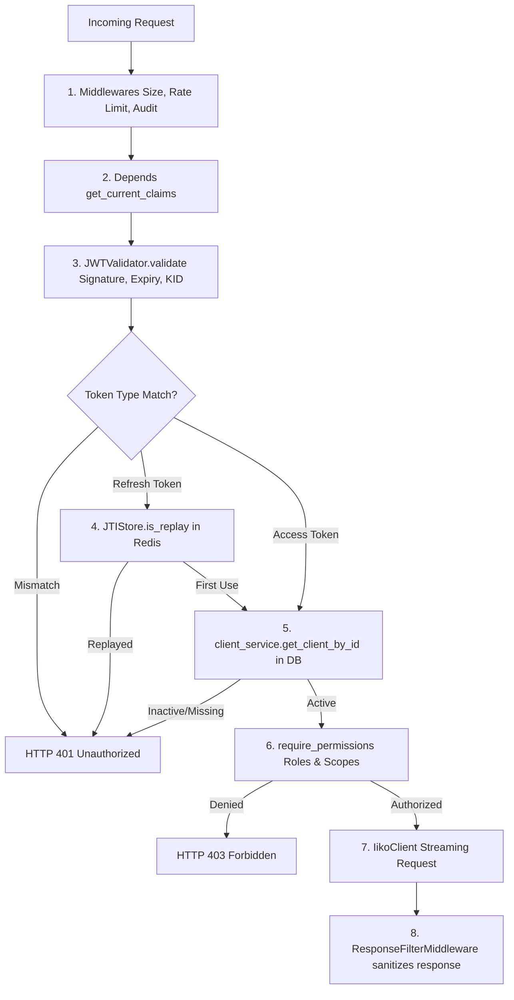

# ISAG — Code Structure & Module Architecture

The **iiko Secure API Gateway (ISAG)** is built using a **modular, layered architecture** focusing on **dependency injection (DI)** and **fail-closed security principles**.

---

## 1. Architectural Patterns

### Middleware Execution Order (LIFO)
FastAPI executes middleware in a Last-In-First-Out stack. Middlewares are registered in reverse order of request execution:
*   **Outermost Middlewares** (First to receive requests): Execute cheap, high-volume rejections (HSTS headers, size verification, IP rate limiting) without touching the database or Redis.
*   **Innermost Middlewares** (Last to receive requests): Handle metrics collection, auditing, and authorization filters, which require request parsing and database/Redis communication.

---

## 2. Core Modules Breakdown

### A. Core Infrastructure (`app/core/`)
*   **`config.py`**: Strict settings validation via `pydantic-settings`. Loads keys once on startup and caches them in memory.
*   **`redis.py`**: Async Redis client session connection pooling.
*   **`metrics.py`**: Prometheus metrics declarations and label normalization helpers.
*   **`hashing.py`**: Bcrypt hashing functions and constant-time `dummy_verify()` execution.
*   **`logging.py`**: JSON-structured logger setup for threat forensics.

### B. Security & Identity Layer (`app/security/`)
*   **`jwt_validator.py`**: Validates JWT signatures (RS256), handles Key ID (`kid`) dynamic key selection, checks expiration claims, and enforces token type constraints.
*   **`jti_store.py`**: Stateful replay checker implementing the 2-second grace period counter.
*   **`rbac.py`**: Role-Based Access Control logic mapping scopes to endpoint actions.

### C. Database & Models Layer (`app/db/` and `app/models/`)
*   **`db/engine.py`**: Handles SQLAlchemy 2.0 async engine configuration and session dependency creation.
*   **`models/client.py`**: The `GatewayClient` database schema.
*   **`models/audit.py`**: Contains `AdminAuditLog` and `GatewayRequestLog` database schemas.

### D. Middlewares Stack (`app/middleware/`)
*   **`secure_headers.py`**: Injects transport-level security headers (HSTS, CSP, X-Frame-Options).
*   **`size_validator.py`**: Immediately drops payload streams larger than 10MB.
*   **`rate_limiter.py`**: SlowAPI distributed rate limiting wrapper.
*   **`metrics.py`**: Measures latency and path-normalized request counts.
*   **`response_filter.py`**: Sanitizes outgoing headers (removes server versions).

### E. API Routers (`app/api/`)
*   **`auth.py`**: Coordinates `/auth/token`, `/auth/refresh`, and `/auth/me` endpoints.
*   **`proxy.py`**: Orchestrates secure proxy routing `/api/{path}`.
*   **`admin.py`**: Controls analytics, client registry updates, and the global Kill-Switch.

---

## 3. Request Dependency Injection Graph

When a request is routed, FastAPI resolves dependencies in the following order:

