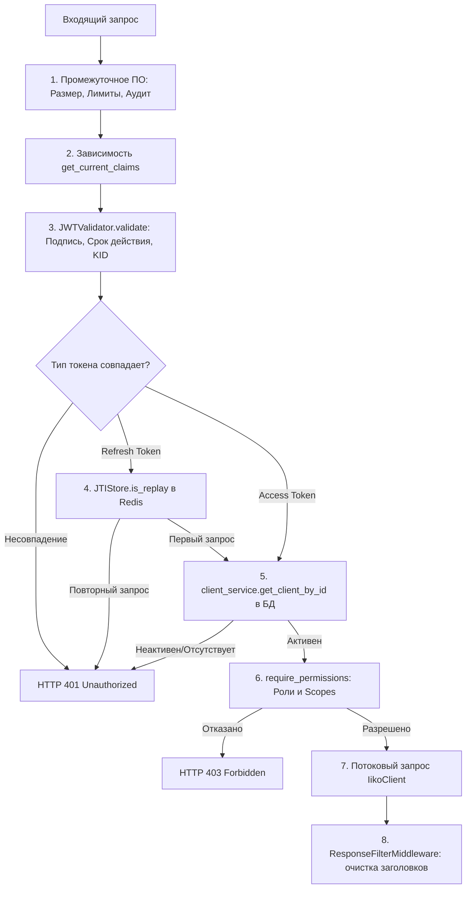

# ISAG — Структура кода и архитектура модулей

Приложение **iiko Secure API Gateway (ISAG)** разрабочено на основе **модульной многослойной архитектуры** с фокусом на **внедрение зависимостей (DI)** и принцип **безопасной блокировки при сбоях (fail-closed)**.

---

## 1. Архитектурные паттерны

### Порядок выполнения промежуточного ПО (Middleware)
FastAPI выполняет стек промежуточного ПО (middlewares) по принципу LIFO (Last-In-First-Out — последним пришел, первым ушел). Регистрация в коде происходит в обратном порядке жизненного цикла запроса:
*   **Внешний уровень (Outermost Middlewares)**: Принимают запросы первыми. Выполняют «дешевые» высокопроизводительные блокировки (заголовки безопасности HSTS, проверка размера тела запроса, ограничение RPS по IP-адресу) без обращения к базе данных или Redis.
*   **Внутренний уровень (Innermost Middlewares)**: Обрабатывают запросы последними перед роутером. Отвечают за сбор метрик, аудит и фильтрацию прав доступа, что требует парсинга запроса и взаимодействия с Redis и реляционной БД.

---

## 2. Разделение по модулям

### A. Базовая инфраструктура (`app/core/`)
*   **`config.py`**: Валидация настроек шлюза через `pydantic-settings`. Загружает RSA-ключи при старте в память и кэширует их.
*   **`redis.py`**: Инициализация асинхронного пула соединений с Redis.
*   **`metrics.py`**: Объявление метрик Prometheus и вспомогательные функции нормализации путей.
*   **`hashing.py`**: Хэширование Bcrypt и выполнение сравнения хэшей за константное время `dummy_verify()`.
*   **`logging.py`**: Настройка структурированного логирования в формате JSON для расследования инцидентов ИБ.

### B. Слой аутентификации и безопасности (`app/security/`)
*   **`jwt_validator.py`**: Валидация подписей JWT (RS256), динамический выбор открытого ключа по `kid`, проверка срока действия (expiration) и типов токенов.
*   **`jti_store.py`**: Компонент защиты от повторных атак (replay protection) с состоянием в Redis и поддержкой 2-секундного льготного окна.
*   **`rbac.py`**: Ролевая модель управления доступом, проверяющая соответствие областей видимости (scopes) и ролей запрошенному действию.

### C. Слой базы данных и моделей (`app/db/` и `app/models/`)
*   **`db/engine.py`**: Настройка асинхронного движка SQLAlchemy 2.0 и предоставление сессии БД в качестве зависимости.
*   **`models/client.py`**: Описание SQL-схемы таблицы клиентов `GatewayClient`.
*   **`models/audit.py`**: Описание SQL-схем таблиц логов `AdminAuditLog` и `GatewayRequestLog`.

### D. Слой промежуточного ПО (`app/middleware/`)
*   **`secure_headers.py`**: Внедрение транспортных заголовков безопасности (HSTS, CSP, X-Frame-Options).
*   **`size_validator.py`**: Немедленное прерывание загрузки тел запросов размером более 10 МБ.
*   **`rate_limiter.py`**: Обёртка распределенного лимитера частоты запросов SlowAPI.
*   **`metrics.py`**: Измерение времени обработки запроса (latency) и сбор метрик с нормализацией путей.
*   **`response_filter.py`**: Очистка исходящих заголовков от отладочной информации (удаление версии сервера Nginx/FastAPI).

### E. Маршрутизация API (`app/api/`)
*   **`auth.py`**: Обработка эндпоинтов `/auth/token`, `/auth/refresh` и `/auth/me`.
*   **`proxy.py`**: Асинхронное безопасное проксирование запросов `/api/{path}` в iiko API.
*   **`admin.py`**: API для аналитики, управления списком клиентов и переключения глобального Kill-Switch.

---

## 3. Граф внедрения зависимостей запроса

При обработке входящего запроса FastAPI разрешает зависимости в следующем порядке:

